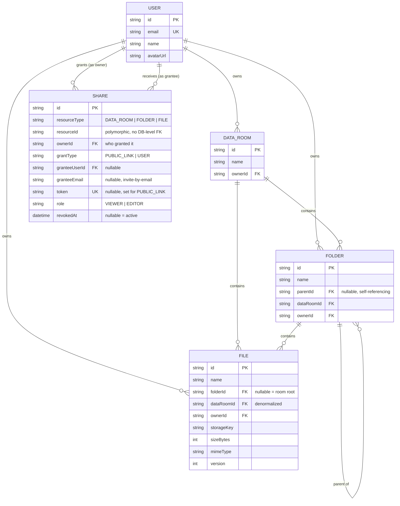

# Data Room

A secure virtual data room for due diligence — folders, files, and read-only sharing, built as a full-stack MVP.

**Live demo:** [data-room-nu.vercel.app](https://data-room-nu.vercel.app)
**API:** [data-room-1g2l.onrender.com](https://data-room-1g2l.onrender.com)

## Tech stack

| Layer | Choice |
|---|---|
| Frontend | React + TypeScript + Vite, Tailwind CSS v4, shadcn/ui components, TanStack Query, React Router |
| Backend | NestJS on the Fastify adapter, Prisma ORM |
| Database | PostgreSQL (Supabase) |
| Auth | Supabase Auth, Google OAuth only |
| File storage | Supabase Storage |
| Hosting | Frontend on Vercel, backend on Render (Docker) |
| Monorepo | pnpm workspaces (`apps/web`, `apps/api`, `packages/shared`) |

`packages/shared` holds the TypeScript types/DTOs and enums used by both apps, so the API's response shapes and the frontend's expectations can't drift apart silently.

## Design decisions

**Data model.** A `DataRoom` is the top-level container (like "My Drive"). `Folder` is self-referencing via a nullable `parentId` (`null` = sits at the room's root), and `File.folderId` is nullable the same way, so files can live directly in a data room without a synthetic root folder. Both `dataRoomId` and `ownerId` are denormalized onto every `Folder`/`File` row — this trades a bit of redundancy for cheap "everything in this room" and "everything I own" queries without walking the tree, which matters once a room has tens of thousands of files (see *How it scales*).

**Sharing is one polymorphic table, not per-resource-type tables.** `Share` has `resourceType` (`DATA_ROOM | FOLDER | FILE`) + `resourceId`, `grantType` (`PUBLIC_LINK | USER`), and a `role` (`VIEWER | EDITOR`, currently only `VIEWER` is ever issued — see below). One row = one grant; revocation is `revokedAt` (soft delete, so there's an audit trail instead of a hole). The trade-off: Postgres/Prisma can't enforce a real foreign key across three possible target tables, so `resourceId` referential integrity is enforced in the service layer, not the database. I considered three nullable FK columns (`dataRoomId`/`folderId`/`fileId` + a `CHECK` that exactly one is set) instead, which would give real FK integrity — I skipped it here to keep the model small, but it's a clean, low-risk migration if this went to production.

**Permission checks walk up; size/count stats walk down — and that asymmetry is deliberate.** To check "can this user see this file," `AccessService` walks from the file up through its folder chain to the data room, checking for a `Share` at each level (a single recursive CTE, bounded by tree depth, which is small). To compute "total size of this folder's subtree," the code walks *down* through every descendant — that's the direction that gets expensive at scale, and it's where the scaling story below actually lives.

**Shares are read-only in the UI on purpose.** The functional spec asks for read-only sharing, so `EDITOR` is modeled in the schema (and `AccessService.requireAtLeast` already understands the role hierarchy `OWNER > EDITOR > VIEWER`) but the `/shares` endpoint always issues `VIEWER`, and the Share dialog never offers an editor option. This isn't a half-finished feature — it's the schema staying forward-compatible without any UI surface for something the brief didn't ask for. Turning it on is a backend-only change (see *How it scales*, question 3).

**Auth: Supabase Auth, verified by asking Supabase, not by local JWT decoding.** The NestJS guard calls `supabase.auth.getUser(token)` (service-role client) on every request rather than verifying the JWT signature locally via JWKS. That's one extra network hop per request, which is the wrong trade-off at real scale but the right one for an MVP: it's correct regardless of whether the Supabase project signs tokens HS256 or RS256, and there's no key-rotation code to get wrong. Swapping in local JWKS verification later is a contained change to one file (`auth.guard.ts`). The first time a user is seen, their row is upserted into our own `User` table (mirroring the relevant bit of Supabase's `auth.users`) so the rest of the schema can hold normal foreign keys to it; after that it's a cache-free read, not a write, on every request.

**Uploads proxy through the API instead of using Supabase's signed upload URLs.** The browser sends multipart form data to the NestJS backend, which streams it into Supabase Storage server-side. Per-file upload progress still works (the frontend uses `XMLHttpRequest`, not `fetch`, specifically to get real `upload.onprogress` events against our own endpoint). The trade-off is that file bytes cross our server twice instead of going straight from browser to storage — fine at demo scale, and the natural next step if this needed to handle much larger files or higher throughput is switching to Supabase's `createSignedUploadUrl` and uploading directly from the browser.

**Name conflicts.** Uploads never block: a colliding name is silently suffixed (`report.pdf` → `report (1).pdf`), matching how Drive-style tools behave when you drop in a duplicate. Explicit renames (and folder creation) are different — those are deliberate actions, so a collision returns `409 NAME_CONFLICT` with a suggested name, and the dialog offers "Use 'X (1)' instead" rather than silently changing what the user typed. Root-level items (`parentId`/`folderId` both `NULL`) needed a Postgres **partial unique index** in addition to the ordinary `@@unique` — Postgres treats `NULL` as distinct from `NULL` in a regular unique constraint, so two root-level files named the same thing wouldn't otherwise collide. See `prisma/migrations/20260818082700_partial_unique_root_names`.

**Deleting a folder that's actively shared.** Deleting a `DataRoom`/`Folder` first walks the subtree (recursive CTE) to collect every descendant folder/file id, deletes any `Share` rows pointing at any of them (plus the item itself) inside the same transaction, *then* lets Postgres cascade-delete the actual rows. A viewer who had that folder open will get a `404`/`410` on their next request (there's no WebSocket push for real-time revocation in this MVP — see *Known limitations*), and the frontend shows "This item is no longer available" instead of a raw error.

## Data model / ERD



Full schema with indexes: [`apps/api/prisma/schema.prisma`](apps/api/prisma/schema.prisma).

## How it scales

**How do you compute the total size and item count of a folder including its whole subtree?**
Two different queries, on purpose. For an entire data room, `File.dataRoomId` is denormalized onto every file regardless of nesting depth, so it's `SUM(sizeBytes) WHERE dataRoomId = X` — an indexed lookup, no tree walk. For an arbitrary folder's subtree (not the whole room), there's no such shortcut yet, so `FoldersService.getStats` runs a recursive CTE that walks down from that folder collecting descendant ids, then aggregates `File` rows against that set. It's correct and fine at MVP scale, but it's an O(subtree size) query, and it's the one place in this codebase that doesn't scale flat. The fix, if a room's folder tree got large, is to stop computing it on read: maintain a denormalized `totalSizeBytes`/`itemCount` counter on `Folder`, updated transactionally (or via a queued job) whenever a file is added, removed, resized, or moved across a folder boundary — updating counters on every ancestor up to the root, which is the same "walk up, it's cheap" direction the permission checks already use.

**What changes when one Data Room holds 100,000 files?**
- **Listing/pagination:** already cursor-based, not offset-based (`GET /data-rooms/:id/items?cursor=...`, using the file's own `id` as the cursor with `orderBy: [{name}, {id}]`), so page 5,000 costs the same as page 1 — no `OFFSET 250000` scan. Folder listings within a single directory are *not* paginated in this MVP (I'm assuming a bounded number of folders per directory, which the prompt's "100,000 files" framing suggests is the actual pressure point); paginating those the same way would be the same pattern if that assumption stopped holding.
- **Indexes:** `Folder` and `File` already carry `dataRoomId`, `ownerId`, and `parentId`/`folderId` indexes, plus the compound `(parentId, name)` / `(folderId, name)` uniqueness used for conflict detection. At 100k+ files, the next addition would be a `pg_trgm` GIN index on `File.name` for `ILIKE`-style search (see *Extra credit*, below).
- **What breaks first in practice:** the per-folder subtree stats query above, and — more subtly — the `AccessService.findShareRole` check, which currently does one `Share` lookup per request scoped to a handful of `(resourceType, resourceId)` pairs (cheap, since the ancestor chain is shallow); that one's fine at any file count because it's bounded by tree *depth*, not room size.

**How does sharing extend to per-user roles (viewer/editor) without remodeling?**
It doesn't need remodeling — `Share.role` already stores `VIEWER | EDITOR`, and `AccessService` already resolves an effective role through a rank comparison (`OWNER > EDITOR > VIEWER`) rather than a boolean. The only reason `EDITOR` isn't reachable today is that `SharesService.create` hardcodes `role: VIEWER` (the spec asks for read-only sharing) and the frontend's Share dialog never offers another option. Turning it on is: (1) accept a `role` field in `CreateShareDto`, (2) change the write endpoints in `FoldersService`/`FilesService` that currently call `requireAtLeast(role, "EDITOR")` — they already do, since I didn't gate those on `OWNER` — to keep working unchanged, because an `EDITOR` share now resolves to `"EDITOR"` and already clears that bar, and (3) add the role picker in `ShareDialog.tsx`. No migration, no new tables.

## Extra credit attempted

**Search by file name** — not implemented; time-boxed out in favor of getting the core flows (upload edge cases, delete-while-shared, rename conflicts) solid. If added, the natural shape given the schema above is a `pg_trgm` GIN index on `File.name` and a `GET /data-rooms/:id/search?q=` endpoint doing an `ILIKE`/similarity query scoped to `dataRoomId` (cheap: it's the same denormalized-`dataRoomId` shortcut the room-wide stats query uses).

**File versioning on name conflicts** — not implemented. The schema already carries a `version` integer on `File` for exactly this; the missing piece is an endpoint to re-upload into an existing `File` id (bumping `version`, keeping the old `storageKey` around instead of deleting it) rather than always minting a new row.

## Known limitations

- No real-time push: if someone deletes a folder while another user is looking at it, that user finds out on their *next* request (a click, a refresh), not instantly via a socket. Explicitly out of scope per the brief's cost/complexity tier.
- The auth guard's per-request `supabase.auth.getUser()` call is a network round-trip; fine at demo traffic, not the right call at real load (see design decisions above).
- Uploads proxy through the API server rather than going straight from the browser to Supabase Storage.

## Project layout

```
apps/
  api/     NestJS + Fastify + Prisma backend
  web/     React + Vite frontend
packages/
  shared/  Types/DTOs/enums shared by both apps
```

## Setup — local development

### Prerequisites

- Node.js 22+, [pnpm](https://pnpm.io) 10+ (`.nvmrc` is included if you use nvm: `nvm use`)
- A free [Supabase](https://supabase.com) project

### 1. Supabase project

1. Create a project at [supabase.com](https://supabase.com).
2. **Auth → Providers → Google**: enable it and fill in a Google OAuth Client ID/Secret ([Google Cloud Console](https://console.cloud.google.com/apis/credentials) → OAuth client ID → Web application). Add `https://<your-project>.supabase.co/auth/v1/callback` as an authorized redirect URI on the Google side.
3. **Auth → URL Configuration**: add your frontend URL (`http://localhost:5173` for local dev, plus your Vercel URL once deployed) to *Redirect URLs*.
4. **Storage → Create a new bucket** named `data-room-files` (private — the API only ever hands out short-lived signed URLs, so the bucket itself should not be public).
5. **Project Settings → Database**: copy the pooled connection string (`DATABASE_URL`, port 6543, `?pgbouncer=true`) and the direct connection string (`DIRECT_URL`, port 5432).
6. **Project Settings → API**: copy the Project URL, the `anon` public key, and the `service_role` secret key.

### 2. Install and configure

```bash
git clone <this-repo>
cd data-room
pnpm install

cp apps/api/.env.example apps/api/.env      # fill in the Supabase values from step 1
cp apps/web/.env.example apps/web/.env      # VITE_SUPABASE_URL / VITE_SUPABASE_ANON_KEY / VITE_API_URL

pnpm --filter @data-room/shared build
pnpm --filter @data-room/api exec prisma migrate deploy
```

### 3. Run

```bash
pnpm dev:api    # http://localhost:4000
pnpm dev:web    # http://localhost:5173
```

## Deployment

### Backend → Render

1. New **Web Service** → connect this repo → **Runtime: Docker**.
2. **Dockerfile Path**: `apps/api/Dockerfile`. **Docker Build Context Directory**: `.` (repo root — the image needs the whole workspace, not just `apps/api`).
3. Environment variables: everything in `apps/api/.env.example` (`DATABASE_URL`, `DIRECT_URL`, `SUPABASE_URL`, `SUPABASE_SERVICE_ROLE_KEY`, `SUPABASE_STORAGE_BUCKET`, `CORS_ORIGIN` set to your Vercel URL).
4. The container runs `prisma migrate deploy` on boot before starting the server, so migrations apply automatically on each deploy.
5. A `render.yaml` blueprint is included at the repo root if you'd rather deploy via `render blueprint`.

### Frontend → Vercel

Two ways to deploy this, since it's a pnpm-workspace monorepo and Vercel needs to know that:

**Via the dashboard (Git-connected, recommended for ongoing deploys):** import the repo, set the project's **Root Directory** to `apps/web`. `apps/web/vercel.json` points the build/install commands back at the monorepo root (`cd ../.. && pnpm ...`) so `@data-room/shared` builds first — this works here because Vercel's Git integration clones the *whole* repo before applying Root Directory as just the build's working directory.

**Via the CLI, deploying straight from a local checkout (no GitHub required):** run `vercel` from the **repo root**, not `apps/web` — a CLI deploy only uploads the directory you run it from, so running it inside `apps/web` never sees `pnpm-lock.yaml` or `packages/shared` and the build fails silently. The root-level `vercel.json` (no `cd ../..` needed, since root *is* the upload root) handles this:
```bash
vercel link            # first time: link/create the project
vercel env add VITE_SUPABASE_URL production
vercel env add VITE_SUPABASE_ANON_KEY production
vercel env add VITE_API_URL production   # your Render URL
vercel --prod
```

Either way: once deployed, add the resulting Vercel URL to Supabase's **Auth → URL Configuration** redirect list, and to the API's `CORS_ORIGIN` env var on Render.

## AI Usage

I used AI-assisted development ([Claude Code](https://claude.com/claude-code)) throughout the project for:

- initial scaffolding and boilerplate;
- exploring implementation approaches;
- generating and reviewing repetitive code;
- debugging;
- improving error handling and edge cases;
- reviewing the final implementation.

All architectural decisions, integration, validation, and final code review were performed manually. Concretely, that included: settling the data model and sharing design (including the polymorphic `Share` table and the up-the-tree-vs-down-the-tree cost asymmetry behind the scaling answers below) before implementation started; verifying the generated SQL against a real Postgres instance rather than trusting type-checks alone; and diagnosing the deploy-time issues that only showed up against real infrastructure — a monorepo path bug in the Vercel CLI deploy, and a CORS misconfiguration (`@fastify/cors` defaults to `GET,HEAD,POST` only, silently breaking every rename/move/delete in the browser while still "working" over curl) — by reading actual logs and network traces rather than guessing.
